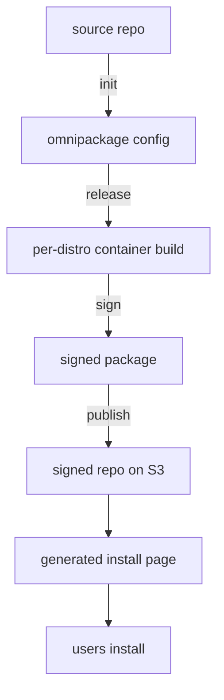

# How it works

A high-level walkthrough of what happens during `omnipackage release`. This page is conceptual — it explains the model, not the flags.

## What it is

OmniPackage is a thin wrapper over existing Linux packaging infrastructure. `rpmbuild`, `debuild`, `makepkg`, `createrepo_c`, `dpkg-scanpackages`, `repo-add`, `gpg`, container runtimes (`podman` / `docker`), `apt` / `dnf` / `zypper` / `pacman` — none of it is reinvented. OmniPackage drives these tools in the right order, per distro, with sensible defaults, so one project repo can ship signed packages to many distros from one config file.

The motivation is on [About](https://omnipackage.org/about): native Linux packaging works well for distro maintainers, but it is a steep climb for individual developers who want their users to `apt install` their software. OmniPackage closes that gap on both sides — developer UX (one config, one command) and user UX (a generated install page with four copy-paste commands).

## Two flows, one pipeline

There's a developer-side flow and a user-side flow. The pipeline produces both.



### Developer side

1. **Scaffold** *(optional)* — `omnipackage init` detects the project type from marker files (`Cargo.toml`, `go.mod`, `CMakeLists.txt`, `pyproject.toml`, …) and renders a starter `.omnipackage/config.yml` plus per-format template files (RPM `.spec.liquid`, `debian/` directory, pacman `PKGBUILD.liquid`). The generated templates are starting points, not finished configs: expect to edit `config.yml`, the spec, and the `debian/` files to match what your project builds and ships. Skip this step if you would rather hand-write the config from one of the [examples](../examples.md).

2. **Release** — `omnipackage release` reads the config and, for each configured distro:
    - Pulls the distro container image (`opensuse/leap:16.0`, `fedora:42`, `debian:trixie`, `archlinux:latest`, etc.).
    - Runs the distro's own setup commands inside the container — `zypper install ...`, `apt-get install build-essential debhelper ...`, `dnf install rpmdevtools ...`, `pacman -Syu base-devel ...`. These are not OmniPackage code; they are verbatim distro-native shell commands.
    - Renders the `.spec` (RPM), `debian/` (DEB), or `PKGBUILD` (pacman) templates with project and distro variables via Liquid, then invokes the distro's native build tool (`rpmbuild`, `debuild`, `makepkg`).
    - Signs the resulting `.rpm` / `.deb` / `.pkg.tar.zst` with the configured GPG key. The same key signs packages and repo metadata.
    - Builds repo metadata with the distro-native tool — `createrepo_c` for RPM, `dpkg-scanpackages` for DEB, `repo-add` for pacman.
    - Uploads the signed packages and metadata to S3 (or any S3-compatible store: R2, GCS, B2, MinIO; see [`s3_repository`](s3_repository.md)).
    - Generates the [install page](install_page.md) (`install.html`) and, next to it, `install.sh` — a one-line installer that auto-detects the user's distro — and `install.json`, the same per-distro data in machine-readable form for automation.

`omnipackage prime` is separate from this flow: it pre-runs the distro setup commands and snapshots the container image to a registry, so later releases skip the slow `apt-get install build-essential` phase. See [`image_caches`](../configuration/image_caches.md).

`omnipackage` runs anywhere a container runtime does (laptop, VPS, any CI). A common setup is free end-to-end: GitHub Actions is free for public repositories, and Cloudflare R2, Backblaze B2, and Google Cloud Storage have free tiers that cover small-to-mid projects.

### User side

What ends up at `<bucket_public_url>/<path_in_bucket>/install.html` is what a real end user sees:

- For DEB-family distros, four lines: add the apt source, import the GPG key, `apt-get update`, `apt-get install <package>`.
- For RPM-family distros, the equivalent `dnf` / `zypper` flow.
- For pacman distros (Arch, Manjaro), import the key with `pacman-key`, add the repo `Server` to `/etc/pacman.conf`, then `pacman -Sy <package>`.

Users who would rather not pick their distro by hand can run the one-line installer instead. It detects the distro from `/etc/os-release`, checks the CPU architecture, and runs the matching steps:

```
curl -fsSL <bucket_public_url>/<path_in_bucket>/install.sh | sh
```

Add `-y` to skip the confirmation prompt, or `--distro <id>` to override detection. `install.json` next to it exposes the same per-distro data — download URLs, GPG public key, install commands — as a machine-readable array for automation.

After install, users receive updates through their distro's normal `apt upgrade` / `dnf upgrade` / `zypper update` / `pacman -Syu`. No opt-in updater, no Electron tray icon, no separate channel. The repo is a normal signed repo served over HTTPS.

## What it does not do

- Build other package formats. RPM, DEB, and pacman only. Flatpak/Snap/AppImage/Nix are a different approach — see [About](https://omnipackage.org/about) for why. (OmniPackage builds pacman packages into its own signed repo; it does not publish to the AUR.)
- Host your repository. You bring the bucket. The trade-off: no vendor lock-in, and your packages live in storage you control.
- Sandbox installed software. Packages run with the same privileges any `apt install` package gets — no Flatpak-style isolation unless you ship it as part of your package (an AppArmor / SELinux profile, a `bwrap` / `firejail` wrapper around your binary).
