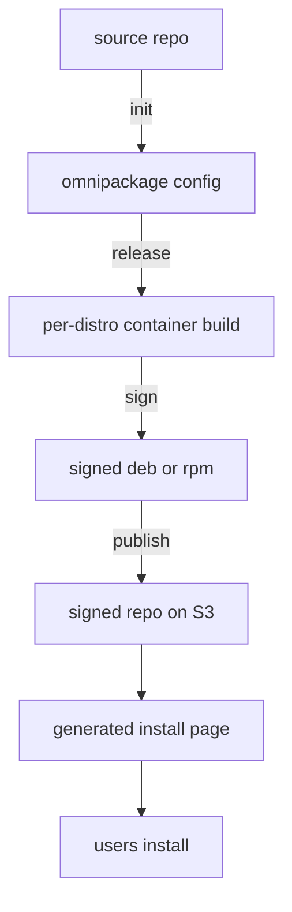

# How it works

High-level walkthrough of what happens when you run `omnipackage release`. This page is conceptual — it explains the model, not the flags.

## What it actually is

OmniPackage is a thin wrapper over Linux packaging infrastructure that already exists. `rpmbuild`, `debuild`, `createrepo_c`, `dpkg-scanpackages`, `gpg`, container runtimes (`podman` / `docker`), `apt` / `dnf` / `zypper` — none of it is reinvented. OmniPackage's job is to drive these tools in the right order, per distro, with sane defaults, so a single project repo can ship signed packages to many distros from one config file.

The motivation is on [About](https://omnipackage.org/about): native Linux packaging works fine for distro maintainers, but it's a steep climb for individual developers who just want users to `apt install` their software. OmniPackage closes that gap on both sides — developer UX (one config, one command) and user UX (a generated install page with four copy-paste commands).

## Two flows, one pipeline

There's a developer-side flow and a user-side flow. The pipeline produces both.

### Developer side

1. **Scaffold** — `omnipackage init` detects the project type by looking for marker files (`Cargo.toml`, `go.mod`, `CMakeLists.txt`, `pyproject.toml`, …) and renders a starter `.omnipackage/config.yml` plus per-format template files (RPM `.spec.liquid`, `debian/` directory).

2. **Release** — `omnipackage release` reads the config and, for each configured distro:
    - Pulls a container image for that distro (`opensuse/leap:16.0`, `fedora:42`, `debian:trixie`, etc.).
    - Runs the distro's own setup commands inside the container — `zypper install ...`, `apt-get install build-essential debhelper ...`, `dnf install rpmdevtools ...`. These aren't OmniPackage code; they're verbatim distro-native shell commands.
    - Renders the `.spec` (RPM) or `debian/` (DEB) templates with project + distro variables via Liquid, then invokes the distro's native build tool (`rpmbuild`, `debuild`).
    - Signs the resulting `.rpm` / `.deb` with the configured GPG key. The same key signs both packages and repo metadata.
    - Builds repo metadata with the distro-native tool — `createrepo_c` for RPM, `dpkg-scanpackages` for DEB.
    - Uploads the signed packages and metadata to S3 (or any S3-compatible store: R2, GCS, B2, MinIO; see [`s3_repository`](s3_repository.md)).
    - Generates an `install.html` landing page with the copy-paste commands users need.

The `omnipackage prime` command sits orthogonally to this — it pre-runs the distro setup commands and snapshots the resulting container image to a registry, so subsequent releases skip the slow `apt-get install build-essential` phase. See [`image_caches`](../configuration/image_caches.md).

`omnipackage` is a CLI — it runs anywhere a container runtime does (your laptop, a VPS, any CI). One common setup is free end-to-end: GitHub Actions covers the build on the free tier for public repositories, and S3-compatible storage is either cheap (AWS) or free under common limits — Cloudflare R2, Backblaze B2, and Google Cloud Storage all have free tiers generous enough for small-to-mid projects.

### User side

What ends up at `<bucket_public_url>/<path_in_bucket>/install.html` is what a real end user sees:

- For DEB-family distros, four lines: add the apt source, import the GPG key, `apt-get update`, `apt-get install <package>`.
- For RPM-family distros, the equivalent `dnf` / `zypper` flow.

After install, users get updates the way they get updates for everything else — through their distro's normal `apt upgrade` / `dnf upgrade` / `zypper update`. There's no opt-in updater, no Electron tray icon, no separate channel. The repo is a normal repo, signed, served over HTTPS.

## What it does not do

- Build new package formats. RPM and DEB only. Flatpak/Snap/AppImage/AUR/Nix are different bets — see [About](https://omnipackage.org/about) for why.
- Host your repository. You bring the bucket. The trade-off is no vendor lock-in and your packages live in storage you control.
- Sandbox installed software. Packages run with the same privileges any `apt install` package gets — there's no Flatpak-style isolation.
